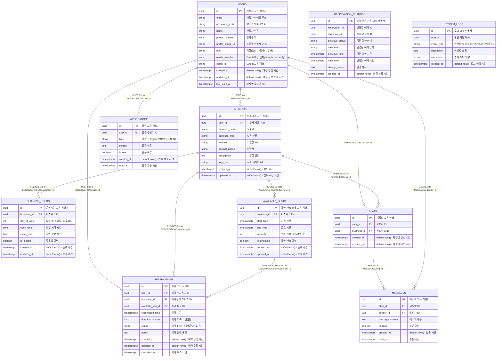

```mermaid
erDiagram
    USERS {
        uuid id PK "사용자 고유 식별자"
        string email "사용자 이메일 주소"
        string password_hash "암호화된 비밀번호"
        string name "사용자 이름"
        string phone_number "전화번호"
        string profile_image_url "프로필 이미지 URL"
        string role "역할(일반 사용자/사업자)"
        string oauth_provider "OAuth 제공 업체(Google, Kakao 등)"
        string oauth_id "OAuth 고유 식별자"
        timestamptz created_at "default now() - 계정 생성 시간"
        timestamptz updated_at "default now() - 계정 정보 수정 시간"
        timestamptz last_login_at "마지막 로그인 시간"
    }

    BUSINESS {
        uuid id PK "비즈니스 고유 식별자"
        uuid user_id FK "사업자 사용자 ID"
        string business_name "상호명"
        string business_type "업종 분류"
        string address "사업장 주소"
        string contact_phone "연락처"
        text description "사업장 설명"
        string logo_url "로고 이미지 URL"
        timestamptz created_at "default now() - 등록 시간"
        timestamptz updated_at "default now() - 정보 수정 시간"
    }

    BUSINESS_HOURS {
        uuid id PK "운영시간 고유 식별자"
        uuid business_id FK "비즈니스 ID"
        int day_of_week "요일(0: 일요일, 6: 토요일)"
        time open_time "영업 시작 시간"
        time close_time "영업 종료 시간"
        boolean is_closed "휴무일 여부"
        timestamptz created_at "default now() - 등록 시간"
        timestamptz updated_at "default now() - 수정 시간"
    }

    AVAILABLE_SLOTS {
        uuid id PK "예약 가능 슬롯 고유 식별자"
        uuid business_id FK "비즈니스 ID"
        timestamptz start_time "시작 시간"
        timestamptz end_time "종료 시간"
        int capacity "수용 가능 인원/예약 수"
        boolean is_available "예약 가능 여부"
        timestamptz created_at "default now() - 등록 시간"
        timestamptz updated_at "default now() - 수정 시간"
    }

    RESERVATIONS {
        uuid id PK "예약 고유 식별자"
        uuid user_id FK "예약한 사용자 ID"
        uuid business_id FK "예약된 비즈니스 ID"
        uuid available_slot_id FK "예약 슬롯 ID"
        timestamptz reservation_time "예약 시간"
        int duration_minutes "예약 지속 시간(분)"
        string status "예약 상태(대기/확정/취소 등)"
        text notes "예약 관련 메모"
        timestamptz created_at "default now() - 예약 생성 시간"
        timestamptz updated_at "default now() - 예약 수정 시간"
        timestamptz canceled_at "예약 취소 시간"
    }

    CHATS {
        uuid id PK "채팅방 고유 식별자"
        uuid user_id FK "사용자 ID"
        uuid business_id FK "비즈니스 ID"
        timestamptz created_at "default now() - 채팅방 생성 시간"
        timestamptz updated_at "default now() - 마지막 대화 시간"
    }

    MESSAGES {
        uuid id PK "메시지 고유 식별자"
        uuid chat_id FK "채팅방 ID"
        uuid sender_id FK "발신자 ID"
        text message_content "메시지 내용"
        boolean is_read "읽음 여부"
        timestamptz created_at "default now() - 발송 시간"
        timestamptz read_at "읽은 시간"
    }

    RESERVATION_CHANGES {
        uuid id PK "예약 변경 기록 고유 식별자"
        uuid reservation_id "변경된 예약 ID"
        uuid requestor_id "변경 요청자 ID"
        string previous_status "이전 예약 상태"
        string new_status "변경된 예약 상태"
        timestamptz previous_time "이전 예약 시간"
        timestamptz new_time "변경된 예약 시간"
        text change_reason "변경 사유"
        timestamptz created_at "default now() - 변경 기록 시간"
    }

    SYSTEM_LOGS {
        uuid id PK "로그 고유 식별자"
        uuid user_id "관련 사용자 ID"
        string event_type "이벤트 유형(회원가입/로그인/예약 등)"
        text description "이벤트 설명"
        jsonb metadata "추가 메타데이터"
        timestamptz created_at "default now() - 로그 생성 시간"
    }

    NOTIFICATIONS {
        uuid id PK "알림 고유 식별자"
        uuid user_id FK "알림 수신자 ID"
        string type "알림 유형(예약확정/변경요청 등)"
        text content "알림 내용"
        boolean is_read "읽음 여부"
        timestamptz created_at "default now() - 알림 생성 시간"
        timestamptz read_at "알림 읽은 시간"
    }
    
    USERS ||--o{ BUSINESS : "USERS.id to BUSINESS.user_id"
    USERS ||--o{ RESERVATIONS : "USERS.id to RESERVATIONS.user_id"
    BUSINESS ||--o{ BUSINESS_HOURS : "BUSINESS.id to BUSINESS_HOURS.business_id"
    BUSINESS ||--o{ AVAILABLE_SLOTS : "BUSINESS.id to AVAILABLE_SLOTS.business_id"
    BUSINESS ||--o{ RESERVATIONS : "BUSINESS.id to RESERVATIONS.business_id"
    AVAILABLE_SLOTS ||--o{ RESERVATIONS : "AVAILABLE_SLOTS.id to RESERVATIONS.available_slot_id"
    USERS ||--o{ CHATS : "USERS.id to CHATS.user_id"
    BUSINESS ||--o{ CHATS : "BUSINESS.id to CHATS.business_id"
    CHATS ||--o{ MESSAGES : "CHATS.id to MESSAGES.chat_id"
    USERS ||--o{ MESSAGES : "USERS.id to MESSAGES.sender_id"
    USERS ||--o{ NOTIFICATIONS : "USERS.id to NOTIFICATIONS.user_id"
```